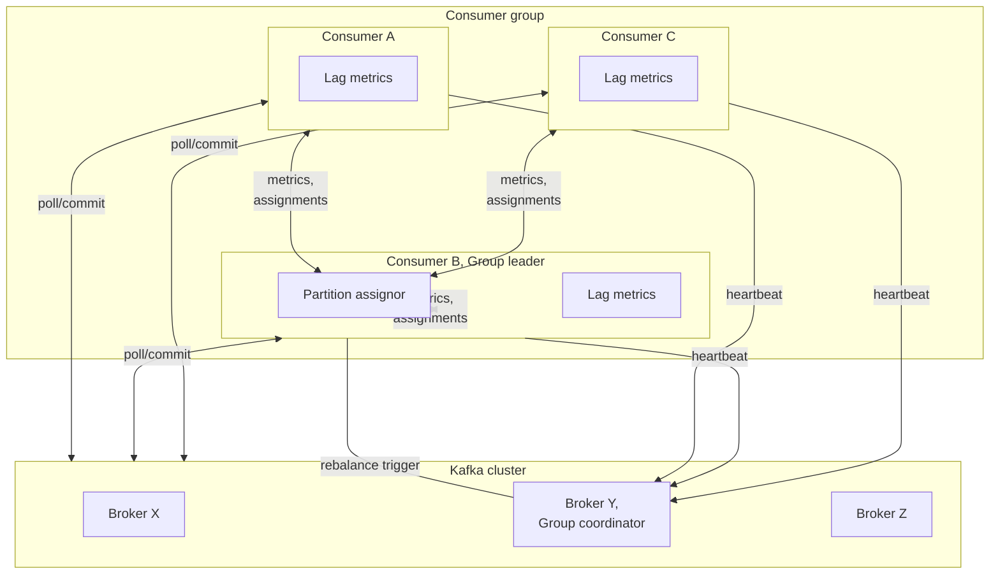

# kafka-assignor-playground

- Set the partition assignment strategy to test via the `partition_assignment_strategy` environment variable, eg `export partition_assignment_strategy=org.apache.kafka.clients.consumer.StickyAssignor`
- Launch the Kafka cluster, producers and consumers: `export COMPOSE_FILE=docker-compose-kafka-<version>.yaml; docker compose up --build`
  - The Kafka cluster is brought up first then a topic is created then the consumers are brought up and finally the producers are launched
  - The producers and consumers simulate workloads with varying cpu processing requirements by sleeping for the amount of time specified in the `cpu_ms` field of the generated events
  - See the current lag with `docker compose exec broker0 bin/kafka-consumer-groups.sh --bootstrap-server broker0:9092 --group group0 --describe`
- Review the consumer logs to evaluate the partition assignment strategy: `docker compose logs consumer0 (consumer1 consumer2)`

Assignors of interest
- kafka-clients: org.apache.kafka.clients.consumer.StickyAssignor
- kafka-clients: org.apache.kafka.clients.consumer.CooperativeStickyAssignor
- com.example.LagCountPartitionAssignor
  - Attempts to balance lag count via periodic rebalances, simulated in partition-assignor-simulator.py
- com.example.LagTimePartitionAssignor
  - Attempts to balance lag time via periodic rebalances, simulated in partition-assignor-simulator.py
  - Lag time is defined as partition lag count / partition consume rate
- com.example.CooperativeLagTimePartitionAssignor
  - Cooperative (and refined) version of LagTimePartitionAssignor

## Versions under test

### Kafka
- 2.8.2

### org.apache.kafka:kafka-clients
- 3.4.0 (with Java 21 and Gradle 8.5)

## Kafka partition assignment

The following diagram shows the relationships between the entities involved in partition assignment.

## Kafka compatibility check

Determine (remotely) if two versions of Kafka are api compatible;
the Kafka version apparently cannot be determined directly via a client.

Compare api version compatibility (older/target version file first):
- `./compare-api-versions.sh <target>-api-versions.txt <test>-api-versions.txt`
